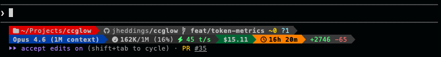

# ccglow

**Your Claude Code statusline, built to impress.**

Single binary. Zero dependencies. Pure ANSI. Infinite composability.


That's the full preset. Want something with more personality? Meet the F1 preset — powerline segments, truecolor, multi-line layout:



Every piece of data you see — path, branch, diffs, tokens, cost, duration — is
an independent segment you can rearrange, restyle, or remove. Build exactly the
statusline you want.

## 🚀 Quick Start

Install with `go install`:

```sh
go install github.com/jheddings/ccglow@latest
```

Then tell Claude Code to use it:

> Set my statusline to use ccglow from https://github.com/jheddings/ccglow

Or add it to `~/.claude/settings.json` directly:

```json
{
  "statusLine": {
    "type": "command",
    "command": "ccglow",
    "padding": 0
  }
}
```

That's it. One binary, no runtime dependencies, no config files required.

## 🎨 Presets

Five built-in layouts, from minimal to maximal.

| Preset | Description | Prerequisites |
|--------|-------------|---------------|
| [**default**](internal/preset/default.json) | The essentials: path, branch, diffs, context, duration | None |
| [**minimal**](internal/preset/minimal.json) | Smart and quiet — shows data only when it matters | None |
| [**full**](internal/preset/full.json) | Everything, all at once | None |
| [**f1**](internal/preset/f1.json) | Multi-line, powerline-styled, truecolor | [Nerd Font](https://www.nerdfonts.com/), truecolor terminal |
| [**moonwalk**](internal/preset/moonwalk.json) | Dark forest theme with powerline separators | [Nerd Font](https://www.nerdfonts.com/), truecolor terminal |

Switch presets with `--preset`:

```sh
ccglow --preset=minimal
ccglow --preset=f1
```

## 🔧 Customization

Presets are just starting points. Use `--config` to load your own layout:

```sh
ccglow --config ~/.claude/ccglow.json
```

A config is a JSON file with a `segments` array. Each segment has a type,
optional style, optional format, and optional conditional visibility:

```json
{
  "segments": [
    { "segment": "pwd.name", "style": { "color": "39", "bold": true } },
    {
      "segment": "git.branch",
      "when": ".branch != '' && .branch != 'main'",
      "style": { "color": "whiteBright", "bold": true, "prefix": " | " }
    },
    {
      "segment": "git.modified",
      "when": "value > 0",
      "format": "+%d",
      "style": { "color": "yellow", "prefix": " " }
    },
    {
      "segment": "context.percent.used",
      "when": ".percent >= 50",
      "style": { "color": "yellow", "prefix": " | " }
    }
  ]
}
```

Segments auto-collapse when they have no data. Groups collapse when all
children are empty. The `when` clause adds conditional logic — show a
segment only when its data meets a condition.

For the full reference:

- 📖 **[Segment Reference](docs/SEGMENTS.md)** — all available segments, format strings, properties
- 🎨 **[Style Reference](docs/STYLE.md)** — colors, attributes, formatting options
- 🔀 **[Conditional Visibility](docs/WHEN.md)** — `when` expressions, operators, examples

## ⌨️ CLI Options

```
Usage: ccglow [flags]

Flags:
  --preset <name>     Use a named preset (default, minimal, full, f1, moonwalk)
  --config <path>     Load JSON config file
  --format <type>     Output format: ansi (default), plain
  --tee <path>        Write raw stdin JSON to file before processing
  --help              Show help
  --version           Show version
```

## 📦 Building from Source

```sh
go build -o ccglow .
```

## Links

- [**Releases**](https://github.com/jheddings/ccglow/releases) — download pre-built binaries
- [**Report a Bug**](https://github.com/jheddings/ccglow/issues/new?labels=bug) — something broken? let us know
- [**Request a Feature**](https://github.com/jheddings/ccglow/issues/new?labels=enhancement) — got an idea? we're listening

## License

MIT
