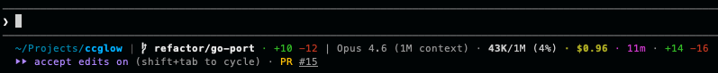

# ccglow



A composable, [spaceship](https://spaceship-prompt.sh)-inspired statusline for [Claude Code](https://claude.ai/code).

Single binary. Zero runtime dependencies. Raw ANSI. Segment tree architecture.

## Quick Start

Install with `go install`:

```sh
# use '@latest' or pick a tagged version
go install github.com/jheddings/ccglow@latest
```

Or run directly without installing:

```sh
go run github.com/jheddings/ccglow@latest
```

Then ask Claude Code:

> Set my statusline to use ccglow from https://github.com/jheddings/ccglow

Or add to your `~/.claude/settings.json` manually:

```json
{
  "statusLine": {
    "type": "command",
    "command": "ccglow",
    "padding": 0
  }
}
```

## Presets

**default** — smart path, git branch + diffs, context usage, session duration

```
~/Projects/ccglow |  main · +5 -3 | 360K (36%) · 2h 15m
```

**minimal** — folder name, branch, token usage

```
ccglow | main | 360K/1M
```

**full** — everything: path, git, model, context, cost, duration, session lines

```
~/Projects/ccglow |  main · +5 -3 | Opus 4.6 · 360K/1M (36%) · $12.50 · 2h 15m · +1200 -85
```

Select a preset:

```sh
ccglow --preset=minimal
ccglow --preset=full
```

## JSON Config

Use `--config` for full customization:

```sh
ccglow --config ~/.claude/ccglow.json
```

```json
{
  "segments": [
    {
      "segment": "pwd.smart",
      "style": { "color": "31" }
    },
    {
      "segment": "pwd.name",
      "style": { "color": "39", "bold": true }
    },
    {
      "segment": "git",
      "style": { "prefix": " | ", "color": "240" },
      "children": [
        {
          "segment": "git.branch",
          "style": { "color": "whiteBright", "bold": true, "prefix": "\ue0a0 " }
        },
        {
          "segment": "git.insertions",
          "style": { "color": "green", "prefix": " +" }
        },
        {
          "segment": "git.deletions",
          "style": { "color": "red", "prefix": " -" }
        }
      ]
    }
  ]
}
```

## Segments

| Segment                 | Provider | Description                       |
| ----------------------- | -------- | --------------------------------- |
| `pwd.name`              | pwd      | Directory basename                |
| `pwd.path`              | pwd      | Full path prefix                  |
| `pwd.smart`             | pwd      | Smart-truncated path prefix       |
| `git.branch`            | git      | Current branch name               |
| `git.insertions`        | git      | Lines added (staged + unstaged)   |
| `git.deletions`         | git      | Lines removed (staged + unstaged) |
| `context.tokens`        | context  | Token count (24K, 1.2M)           |
| `context.size`          | context  | Context window capacity           |
| `context.percent`       | context  | Usage percentage                  |
| `model.name`            | model    | Model display name                |
| `cost.usd`              | cost     | Session cost in USD               |
| `session.duration`      | session  | Session wall-clock time           |
| `session.lines-added`   | session  | Lines added this session          |
| `session.lines-removed` | session  | Lines removed this session        |
| `literal`               | —        | Static text                       |

### Colors

Colors support three formats:

- **Named**: `cyan`, `whiteBright`, `red`, `green`, etc. (16 ANSI colors)
- **256-color**: `"39"`, `"240"` (numeric string)
- **Truecolor**: `"#00afff"` (hex)

### Style Attributes

| Attribute | Type    | Description                     |
| --------- | ------- | ------------------------------- |
| `color`   | string  | Text color (named, 256, or hex) |
| `bold`    | boolean | Bold text                       |
| `italic`  | boolean | Italic text                     |
| `prefix`  | string  | Text before the value           |
| `suffix`  | string  | Text after the value            |

## CLI Options

```
Usage: ccglow [flags]

Flags:
  --preset <name>     Use a named preset (default, minimal, full)
  --config <path>     Load JSON config file
  --format <type>     Output format: ansi (default), plain
  --tee <path>        Write raw stdin JSON to file before processing
  --help              Show help
  --version           Show version
```

## Building from Source

```sh
go build -o ccglow .
```

## License

MIT
